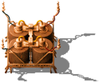
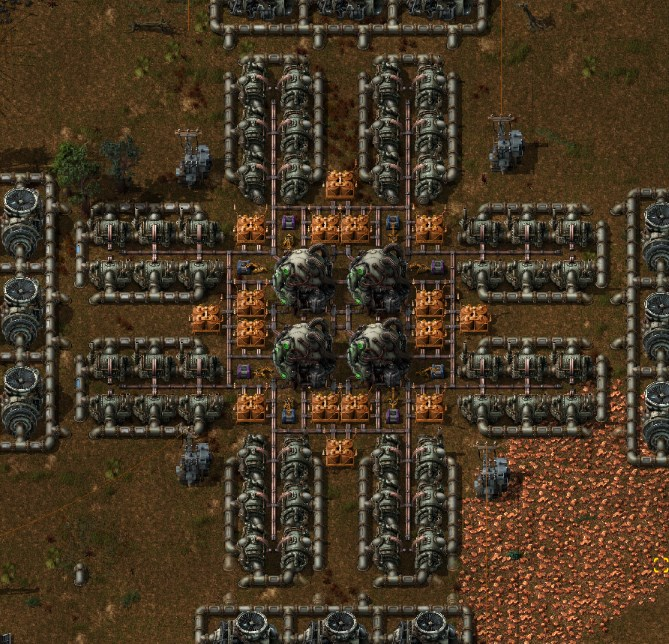

Heat Accumulator -- A Mod for Factorio v0.15
============================================

This is a mod for a game called Factorio. It's compatible with Factorio v0.15.
This mod adds a structure to the game, which is coincidentally named as the
same as the mod itself.

The Heat Accumulators store heat. Heat pipes stores some amount of heat too,
but their specific heat is so low that they are not too useful for energy storage.

A heat accumulator has specific heat of 10MJ, which is ten times larger than a heat pipe.
I don't know what specific heat measured in MJ means. It should have unit of
Joules per degree, but the default settings for heat pipes, heat exchangers and
nuclear reactors have that unit.
At least it is certainly ten times larger than that of heat pipe.

It is useful for regulating power load with nuclear reactors.

There are some ways to store energy in Factorio.
Accumulators are obvious, but you can also store energy in steam's heat in a storage tank.
I thought there should be another way to store pure heat like accumulators for electricity.

Unfortunately there seems to be no way to obtain temperature as a circuit signal.
If I could, I could build an automated feedback loop to keep the number of active
reactor cores optimal.
Maybe I could read the temperature value of an entity every tick and output as another
signal, but it would be so inefficient to do from a script.

Known Issues
------------

  * You can walk on heat accumulators. This is because the structure has type of heat pipe,
    which makes the structure walkable, ignoring collision box setting.
    I don't know if there is a way to avoid this issue.	
